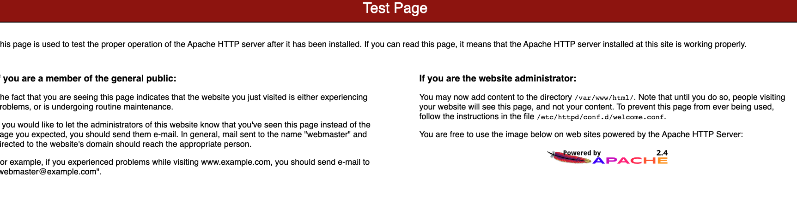
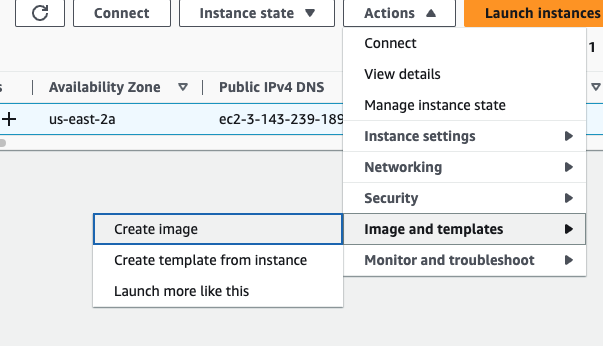

# AMI

For this I am going to launch instance, scroll down, choose Amazon Linux 2, t2.micro, used an existing security group, scroll down go to advanced setting, user data

```
#!/bin/bash
# Use this for your user data (script from top to bottom)
# install httpd (Linux 2 version)
yum update -y
yum install -y httpd
systemctl start httpd
systemctl enable httpd
```

The instance is going to launch and install the Apache webserver.

if we open in the browser <http://publicIPAddress>
we can the following page:



Next step, create image using this instance, click on the instance -> Actions-> Image and templates -> Create image



AMI is going created.


Next step is wait a little bit while my ami can be use., it should be on available status.
So now I can crete an instance from my ami


It was much quicker, could be security software, much faster boot up.
