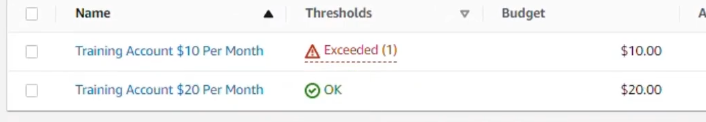
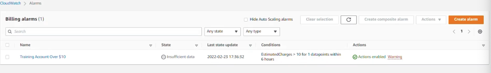

# Setting up the AWS Budgets and CLOUDWATCH alerts

Navigate to the Budget--> Cost budget --> Training Account $20 per Month --> Period Monthly --> Recurring budget -->  Start Month February 2023 --> Budgeting method --> Fixed -- >
Budget Scope --> Filter specific AWS cost dimensions -->
Service --> EC2 instances --> Only costs related to EC2 instances --> Alert threshold --> 80% of budgeted amount --> Trigger actual --> Email recipients --> add email --> Next --> review everything --> Create budget

CloudWatch --> Alarms --> Billing --> Create Alarms --> Static value --> Greater than 10$ --> In alarm state --> Create new topic --> email --> preview and create 

