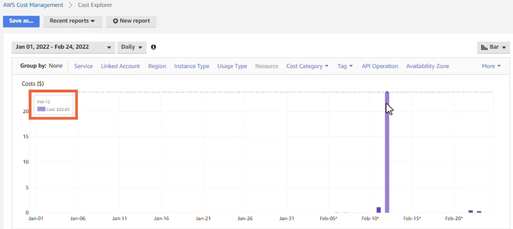
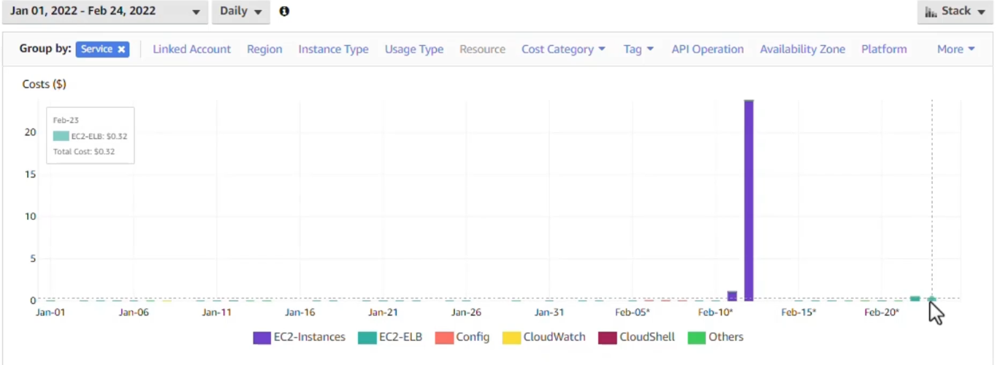
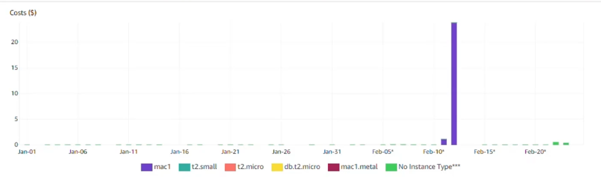
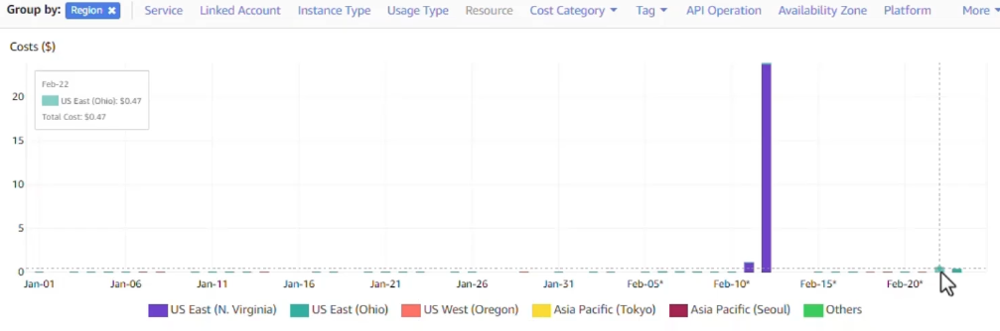

# Working with Cost Explorer

Navigate to the Cost Explorer --> for first using the Cost Explorer you have to set up which is getting ready within 24 hours--> View in Cost Explorer --> Can use the Group by Service 

If group by instance type 

And group by region

