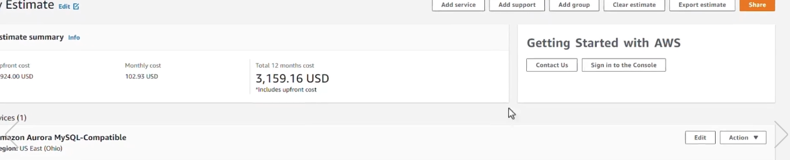
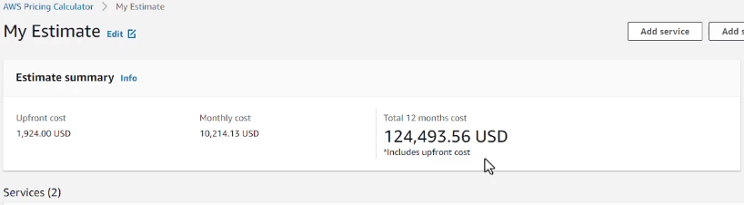

# Working with AWS Pricing Calculator

Accurate estimate for EC2, all different services, figure out discounts etc, this is located in calculator.aws website

Create estimate --> Choose services--> Aurora Database --> Aurora MySQL compatible--> Nodes 4--> Pricing Model is Reserved Instances for 1  to 3 years, all upfront purchases--> 1 year Lease offering--> Database storage - 1Tb for total size of clusters--> click Create estimate

If add service--> Add Service --> EC2 instance--> Quick estimate, going to default settings--> 100instances--> On-Demand Instances --> Add to my estimate

