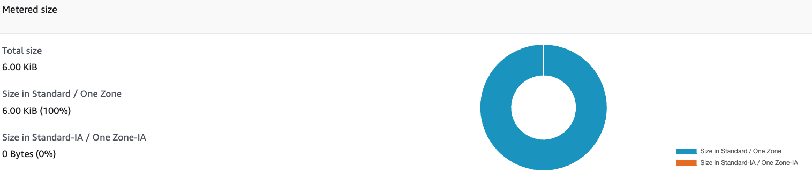

# EFS practice

Navigate to the EFS -> Create file system -> which is going to be network file system
To learn different options when creating EFS file system -> click the Customize in the bottom.

File system settings:
Name is optional leave it blank -> Storage class -> Standard -> Stores data redundantly across multiple AZs -> Automatic backups -> leave it default enabled -> Lifecycle management -> If a file has not been accesses for 30 days (if not be using very often), then transition to Standard-Infrequent Access Storage.


For throughput mode, I have two options Bursting and Enhanced, with Bursting, going to get a throughput that scales with the file system, the more scale to have plus some burst. or enhanced, provides more flexibility and higher throughput levels with a range of performance requirements. So chose here bursting mode.


For performance mode, can chose General Purpose and Max I/O. General Purpose , for general purpose as it name indicated, helpful when you have latency-sensitive use cases, such as web serving environments and content management system, for Wordpress and you need some storage then General purpose will be great.

Next network access -> leave it as default except the security group which I created specially for efs -> Click next-> Review -> Create file system!


So here is my filesystem, and it's available, when you have a filesystem you only pay for the storage you use , so right now, mark cost is zero.



And now I want to mount to onto EC2 instances, for this purpose I should launch an instance.

While launching the instance, I have to edit my network settings to add subnet us-east-2a, and after this one I can see the file system info add shared file system -> Create an instance.


I have to create 2 instances and mount my file system onto them. So if I go to the EC2 instances , and if have a look at the inbound rules , it allows protocol NFS on port 2049.

Now for verify, for it I connect my first instance, ls /mnt/efs/fs1 , it is empty, make it simple, I will elevate my right and type sudo su to root user.

```
sudo su
echo "hello naza" > /mnt/efs/fs1/hello.txt
```

So I've created the hello.txt file in to my /mnt/efs/fs1 into my EFS file system, which is in us-east-2a, which I can see in another ec2 instance where my efs was mounted.


So for finishing my project, I have to terminate 2 instances and delete the EFS, delete the security groups:

This error can happen when the security group you are trying to delete is referenced in a rule of another security group.

To fix this, in each security group remove the rule that is referencing the other group.
Then, delete the security groups themselves.
