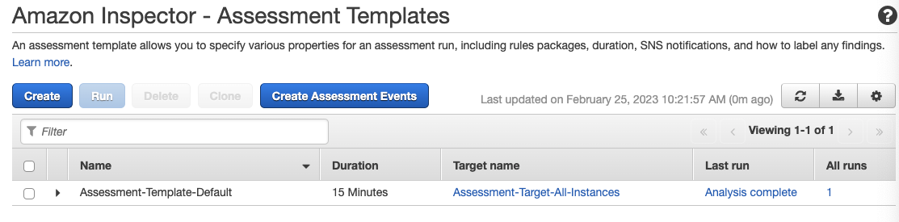

# Creating the EC2 instance for working with Amazon Inspector

Create Amazon EC2 instance in Ohio Region, and check which security groups created for my instance. Then click security group --> edit inbound rules --> Add rule --> All traffic--Source--> Anywhere IPv4

Next step navigate to the Amazon Inspector --> Classic Amazon Inspector, please check all the EC2 instance running--> Rules packages --> Network Reachability go to instance from outside and checks for vulnerabilities --> Create

It will collect information from Ec2,  and analyze it. 



Amazon runs or in Findings can download report of findings.

Now go back to the Ec2 instance and connect and click connect, and put following code in CloudShell

```

sudo curl -O https://inspector-agent.amazonaws.com/linux/latest/install

```

```
sudo bash install
```

Agent shows what kind of features we have, so for solving port findings change Security groups inbound rules --> Edit inbound rules --> Add rules for only SSH, Anywhere IPv4.

Then in Amazon Inspector template, click my template and run , and in 15-18 minutes it should prepare the report.
And results are now 2 findings.

For further assessment from inside, I create the new template--> Name vm security, rules package click for all packages exclude the Inspector rules packages. Create and run. Inspector started to run, 