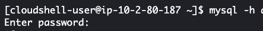

# Creating and Connecting to MYSQL Database

For this practice I have to create database in RDS --> Create Database --> Standard Create --> Templates --> Free Tier --> Give password for the user admin --> Use the default VPC, if you don't have it, please create new VPC default --> for accessing purpose public access it --> Create database

It should take some time for creating the database. For connecting with MYSQL database I use the AWS CLOUDSHELL 

