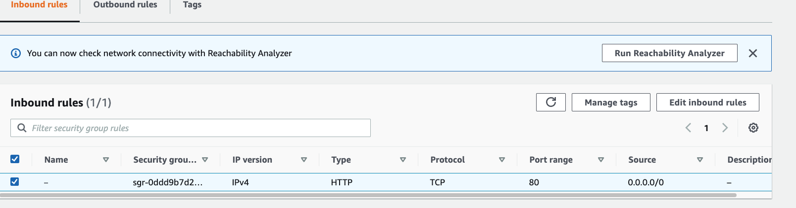
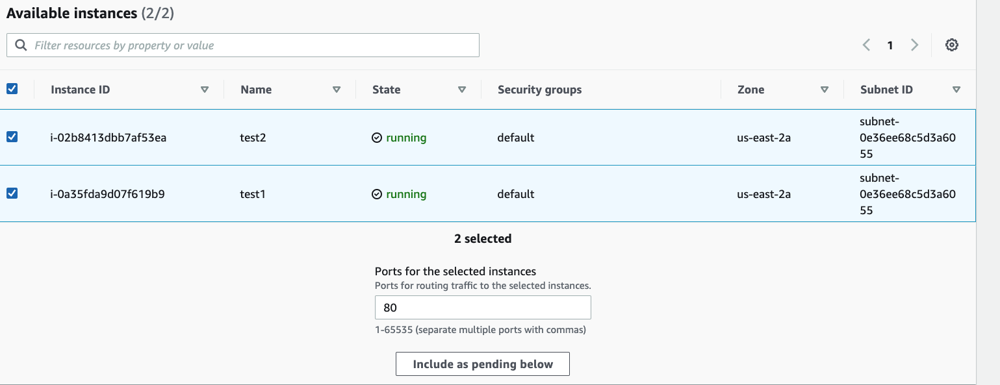
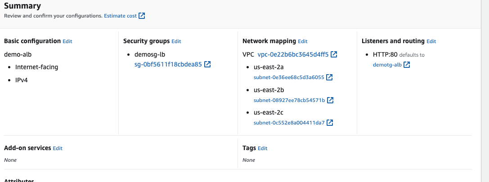

# Practice with Application Load Balancer

So for this purpose, I will create 2 EC2 instances, going to use Amazon Linux 2, t2.micro, proceed without key pair, don't need SSh capability, use existing security group which allowed to do HTTP traffic and SSh traffic into EC2 instance, basic storage -> add script into user data in Advanced Settings:

```
#!/bin/bash
# Use this for your user data (script from top to bottom)
# install httpd (Linux 2 version)
yum update -y
yum install -y httpd
systemctl start httpd
systemctl enable httpd
echo "<h1>Hello World from $(hostname -f)</h1>" > /var/www/html/index.html
```

After launching the instance if I test copying public IP of my instance it can be shown like


The practice purpose is to have only one URL to access these 2 instances and balance the load between them.

navigate to load balancer -> choose the Application Load balancer -> Create -> Scheme is Internet-facing -> for network mapping deploy in all AZs, going to create new Security Group -> need only allow HTTP traffic, give the name-> demo-sg-alb -> Allow HTTP into load balancer , and the inbound rules is going to allow HTTP from anywhere -> Create security group.



Only left the new created sg.
And while creating the ALb, I have route traffic from HTTP on port 80 to a target group, for example in my case is a group of ec2 instances that were created, Create target group -> group instances together, call it demo-tg-alb -> protocol is HTTP, version HTTP/1 -> register my instances, include them as spending below



Now good to go, and create the ALB, after that I can see that it was created the domain name, through the application load balancer I'm able to get the hello world. If I refresh the page, it actually redirecting between both EC2 instances.




If due to the overload or if my one instance fails, so therefore my one instance is going to be unhealthy, because it cannot respond anymore to the traffic coming in, And so therefore, if I go back to my application balancer and refresh, the only response I'm getting for this instance is that one instance that is still up and running. This is the power of using load balancers because they know when the targets are healthy or not healthy.


After that it will only shows the healthy instance.
