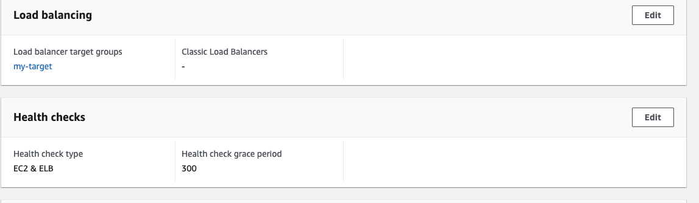

# Practice with creating Auto Scaling Group

Go to EC2 page and under Auto Scaling --> Auto Scaling Groups
Create Auto Scaling Group -> Add group name -> then I need to create Launch Template, it's basically instruction or configuration to use when Auto Scaling Groups go to create instances.
Create launch template --> add name of template--> choose Amazon Linux Machine Image--> have to choose free tier for study purposes--> and in Advanced setting have to add in the User data

```
#!/bin/bash

sudo yum update -y
sudo install httpd -y
sudo systemctl start httpd
sudo systemctl enable httpd 
usermod -aG apache ec2-user
chown -R ec2-user:apache /var/www
chmod 2775 /var/www
echo "Hello world from $(hostname -f)" > /var/www/html/index.html

```

Along with this have to create target group



So choose the launch options, I have the VPC, as well as the ability to launch into 3 different subnets. Leave it as t2.micro.
Next -> can configure advanced options -> Load Balancing is optional -> I choose the option attach to an existing load balancer - choose my target-group from ALB -> so EC2 instances launched as part of Auto Scaling Group are linked to my Application Load Balancer directly.

Health checks is also optional -> two kind of checks -> EC2 health check -> if my EC2 instance fails is going to be removed automatically from my Auto Scaling Group, enable ELB type oh health check. So that if ELD deems that instance in unhealthy, then the ASG will terminate it automatically.

Desire capacity 1, minimum capacity is 1, maximum capacity is 1. --> next -> create ASG.
With desired capacity of 1, to match this capacity ASG was created the instance. if increase the desired capacity, have a second EC2 instance being created,
and after a while is going to be registered into our target group and added.
My instance is now healthy. And so if I go to my ALB and refresh, as we can see I got my two IPs that are looping through my ALB.
