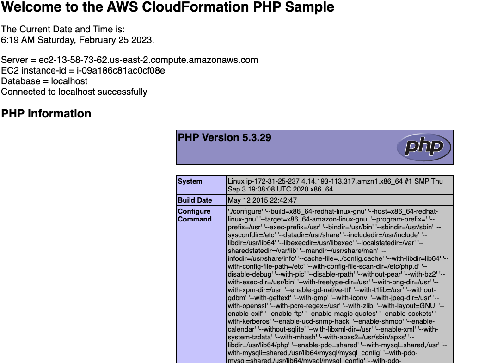

# Deploying a CloudFormation Template

Go to CloudFormation --> Create stack --> Use a sample template--> Choose LAMP (which stands for Linux Apache MySQL and PHP) stack, which will deploy a sing EC2 instance and MySQL database --> give it the stack name (collection of resources which we are gonna span up), give it the password, DBuser, keyname, all default here, finally create stack

If I go to the output, and I can see in browser the same code every time.

With deleting the stack you can create all the EC2 instance, that you created with CloudFormation.