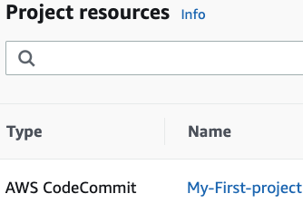
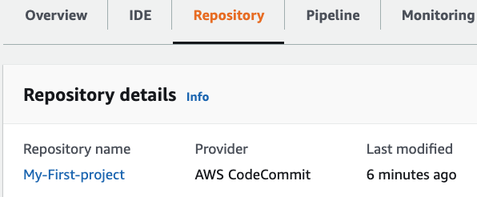
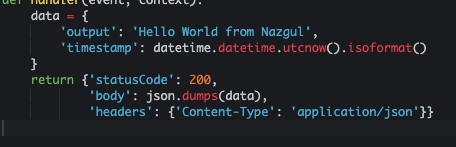
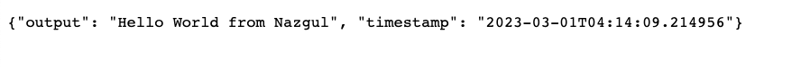

# Working with CodeStar and Cloud9

Navigate to the CodeStar --> Create Project --> 
Choose Python with AWS Lambda --> Project Name My First Project --> Project Id within 15 characters -- myfirst-project --> 
Create new CodeCommit repository which CodeStar will create for me --> Create project

Then Create Cloud9 Environment --> give it the name--> my-first-environment.

In the repository can see the 

If edit the code inside the Cloud9 and edit the hello world message, it will build and deploy in application.

