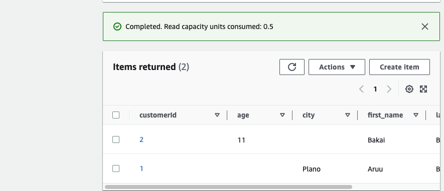

# Creating a DynamoDB Table

Navigate to the DynamoDB --> Create Table --> Here is only create table because DynamoDB is serverless underlying infrastructure is handling for --> Table name is Customers --> Partition key is table's primary key which  we can retrieve from the table --> customerID --> other skip as default and create Table. Then click to the customers table -->  I don't have any items so click to the Create item --> add 1 to Value --> Add new attribute as String --> another attribute for last name --> add new attribute for city --> Create item.
Further I can create the second item --I added first_name, last_name and age attributes 

