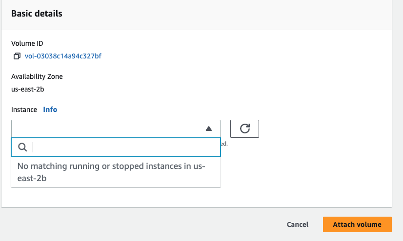

# EBS practice

For this practice, I created the instance in us-east-2a , with default security group, in instance storage I can see that instance has 8 GB volume. Created one more Volume-> Create Volume -> Type -> gpg -> Size 2Gb

Create another volume in different AZ, for practice that another AZ volume cannot be attached to the us-east-2a instance. It only can attach to the instance in the same region.

