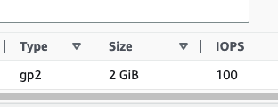
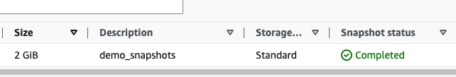
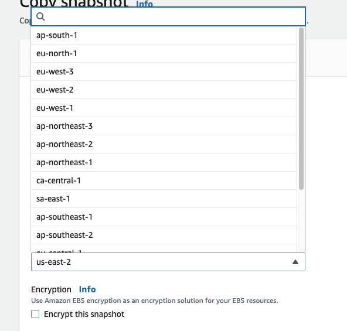
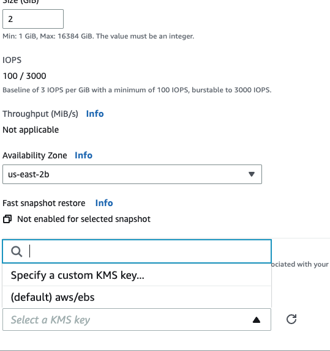
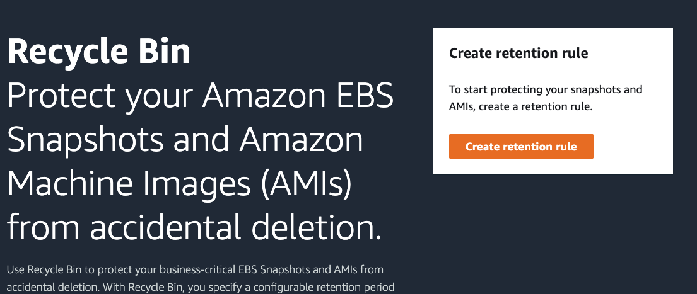
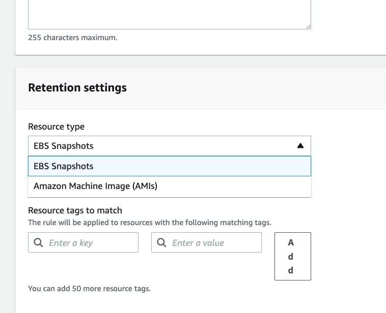

# EBS Snapshots

For this purpose I created the volume with 2GB size.
Then using the existing volume--> Actions--> Create snapshot--> Name --> Create snapshot

We can copy this snapshot to another Region, into any destination os Regions--> It's very handy if you have disaster recovery strategy, to make sure that your data is backed up in another region.

Also I can recreate the volume from snapshot, and choose the other AZ, also can encrypt the volume. 

If we look the Snapshots, can see the Recycle Bin--> Create retention rule --So the way to protect EBS snapshots and AMIs from accidental deletion, if click on create the rule , now it's created

