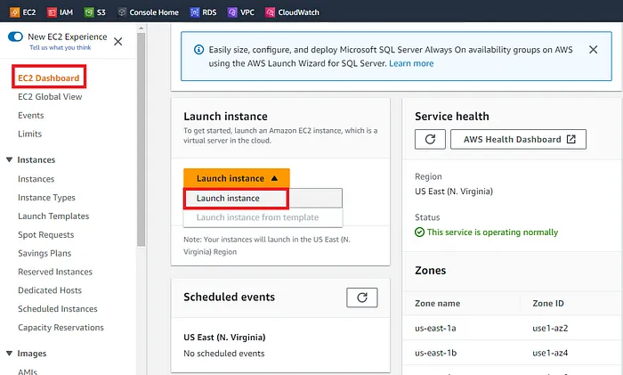

# What is Amazon EKS?

Install aws cli:
```
curl "https://awscli.amazonaws.com/awscli-exe-linux-x86_64.zip" -o "awscliv2.zip"
unzip awscliv2.zip 
sudo ./aws/install 
```

Amazon Elastic Kubernetes Service (Amazon EKS) is a managed service that you can use to run Kubernetes on AWS without needing to install, operate, and maintain your own Kubernetes control plane or nodes. Kubernetes is an open-source system for automating the deployment, scaling, and management of containerized applications.

How does Amazon EKS work?


Create an Amazon EKS cluster in the AWS Management Console or with the AWS CLI or one of the AWS SDKs.
Launch managed or self-managed Amazon EC2 nodes, or deploy your workloads to AWS Fargate.
When your cluster is ready, you can configure your favorite Kubernetes tools, such as kubectl, to communicate with your cluster.
Deploy and manage workloads on your Amazon EKS cluster the same way that you would with any other Kubernetes environment. You can also view information about your workloads using the AWS Management Console.

Agenda:
Setup an EC2 Instance to create a cluster
Setup kubectl
Setup eksctl
Create an IAM Role and attach it to the EC2 instance
Create your cluster and nodes
Create a Pod using Kubectl to Validate the Cluster
Deploying Nginx Container
Delete the EKS cluster

Step 1: Setup Bootstrap Image to create Cluster
In this step, we will first set up a Bootstrap Image using AWS EC2 Instance.

Log in to the Amazon management console, open EC2 Dashboard, click on the Launch Instance drop-down list, and click on Launch Instance as shown below:



Step 2: Setup kubectl
a. Download kubectl version 1.26
b. Grant execution permissions to kubectl executable
c. Move kubectl onto /usr/local/bin
d. Test that your kubectl installation was successful

Let’s first Download the kubectl with the below command:

```
curl -O https://s3.us-west-2.amazonaws.com/amazon-eks/1.26.4/2023-05-11/bin/linux/amd64/kubectl
```

After it is downloaded let’s grant execution permissions to it and move kubectl to /usr/local/bin directory and also test the kubectl installation.


Step 3: Setup eksctl
a. Download and extract the latest release
b. Move the extracted binary to /usr/local/bin
c. Test that your eksclt installation was successful

Let’s first download eksctl and move to /usr/local/bin directory and check its version with the below commands:

```
curl --silent --location "https://github.com/weaveworks/eksctl/releases/latest/download/eksctl_$(uname -s)_amd64.tar.gz" | tar xz -C /tmp
sudo mv /tmp/eksctl /usr/local/bin
eksctl version
0.143.0
```

Step 4: Create an IAM Role and attach it to the EC2 instance
IAM user should have access to IAM, EC2, and CloudFormation

Go to your AWS console and search for IAM. Under Access management, Select Roles and then click on Create role:


As mentioned earlier we need to provide the IAM user access to EC2, Cloudformation, and IAM, however, for the sake of this demo, we will provide full Administrative Access to the User(which is recommended in real-world scenarios).

After creating the role we need to add this role to our Bootstrap EC2 Instance:


Step 5: Create your cluster and nodes
To set up our first Kubernetes cluster we will use the below command in which we have to provide the name of our cluster, the region in which it will be created, and the size of our Instance.

```
eksctl create cluster --name my-demo-cluster \
   --region us-east-1 \
--node-type t2.small
```

The execution of this command will take at least 20 minutes and as you might know, eksctl utilizes Cloudformation at the backend to create the cluster so we should see a new template in Cloudformation.


If we check our EC2 dashboard we should see two new nodes as part of our cluster:


To display what all resources we have in our Kubernetes cluster we can issue the command “ kubectl get all”.

Step 6: Create a Pod using Kubectl to Validate the Cluster
Let’s create a Pod using the kubectl command “kubectl run webapp — image=httpd”, where webapp is the name of our first pod and httpd is the image name.


Deploying Nginx Container
Let's now create a deployment that will help us to create pods. The command for that would be:
```
kubectl create deployment  demo-nginx --image=nginx --replicas=2 --port=80

kubectl get replicaset
NAME                    DESIRED   CURRENT   READY   AGE
demo-nginx-699bd94686   2         2         2       3m7s

kubectl expose deployment demo-nginx --port=80 --type=LoadBalancer
service/demo-nginx exposed
```

Delete the EKS cluster
When you’re done using an Amazon EKS cluster, you should delete the resources associated with it so that you don’t incur any unnecessary costs.

Delete the cluster and its associated nodes with the following command,
```
eksctl delete cluster my-demo-cluster --region us-east-1
```


