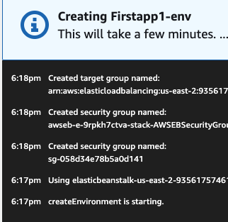
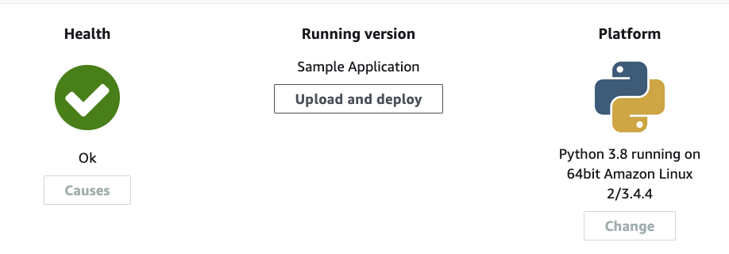
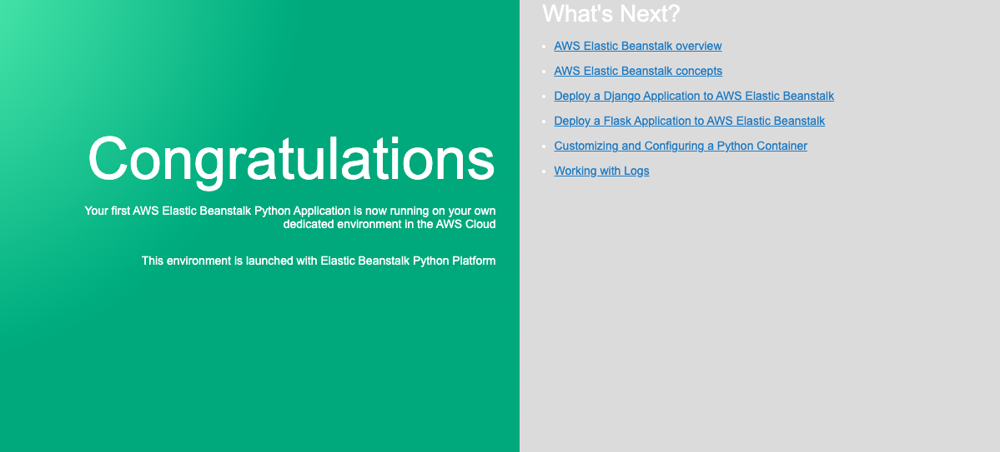
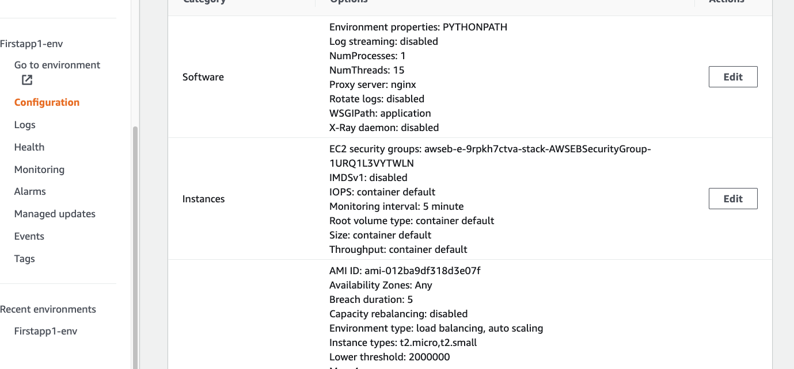

# Create Application with Elastic Beanstalk

Give it name to the application--> Skip the application tags --> Platform--> Choose Python --> python 3.8 running on 64but Amazon Linux2 --> Sample application can help with easy to start with an app. --> Create application.

and voila Elastic Beanstalk created the app

If click to the Configuration, I can see all usage configurations for this application

