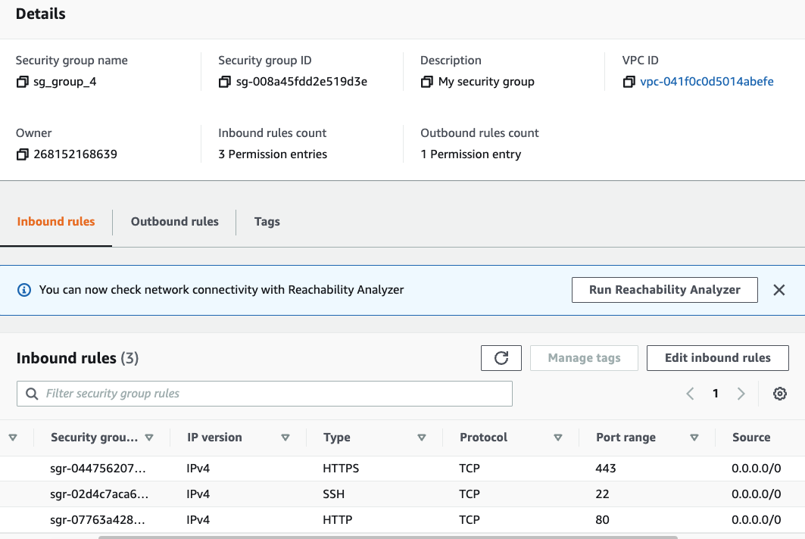
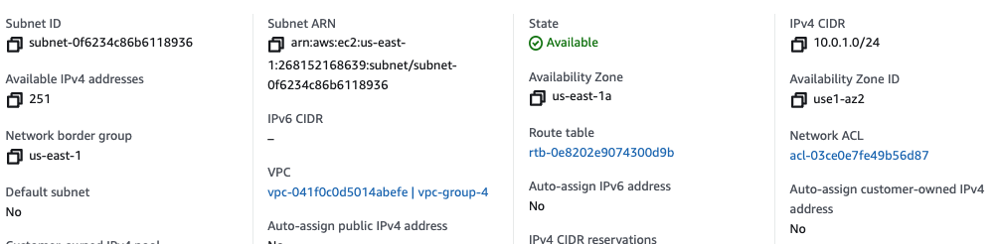
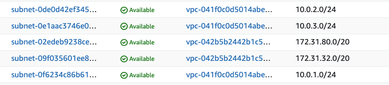
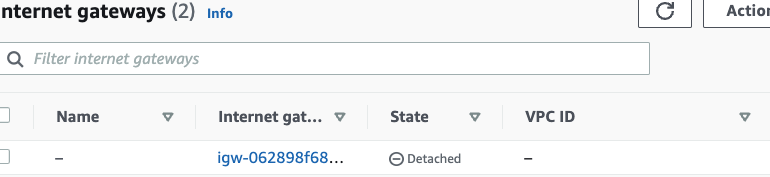
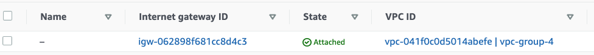
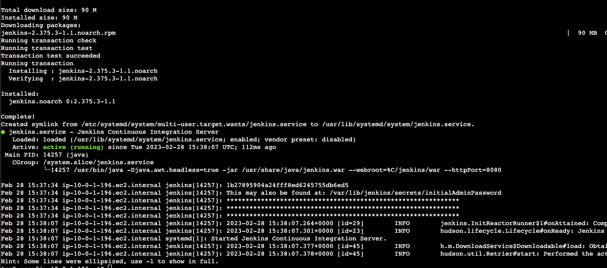

# Group -4 Project

```
Please create EC2-Instance named "Project" and perform all your tasks there(for Group3 and Group4):

Group 4: Write Bash Script that creates:
1. VPC named "vpc-group-4" with CIDR block 10.0.0.0/16
2. Security group named "sg-group-4"
3. Open inbound ports 22, 80, 443 for everything in security group "sg-group-4"
4. Create 3 public subnets: 10.0.1.0/24, 10.0.2.0/24, 10.0.3.0/24 in each availability zones respectively(us-east-2a, us-east-2b, us-east-2c) 
5. Create Internet Gateway
6. Attach Internet Gateway to VPC "vpc-group-4"
7. Create EC2 Instance named "ec2-group-4" with security group "sg-group-4"
8. Install Jenkins on EC2 "ec2-group-4"
```

1) Created the EC2 instance named project in N.Virginia us-east-1d AZ, used default VPC and created the key-pair.
2) Next step is creating Access Key for user --> User --> Create Access Key

```
!#/bin/bash 

# Create AWS VPC
# Variables used in this project
vpcName="vpc-group-4"
cidrBlock="10.0.0.0/16"


# 1.  Create VPC with cidr block /16
# aws ec2 create-vpc --cidr-block "$cidrBlock" 

# 2. Name the VPC
#  aws ec2 create-tags --resources vpc-041f0c0d5014abefe --tags Key=Name,Value=vpc-group-4

# 3. Create Security group named "sg_group_4"
# aws ec2       create-security-group --group-name sg_group_4  --description "My security group" --vpc-id vpc-041f0c0d5014abefe

# 4. Open inbound ports 22, 80, 443 for everything in security group "sg_group_4"
aws ec2 authorize-security-group-ingress \
            --group-id sg-008a45fdd2e519d3e \
            --protocol tcp \
            --port 80 \
            --cidr "0.0.0.0/0"

aws ec2 authorize-security-group-ingress \
            --group-id sg-008a45fdd2e519d3e \
            --protocol tcp \
            --port 22 \
            --cidr "0.0.0.0/0"

aws ec2 authorize-security-group-ingress \
            --group-id sg-008a45fdd2e519d3e \
            --protocol tcp \
            --port 443 \
            --cidr "0.0.0.0/0"

```

Result of created security group inbound rules.


For the next task of our project:

Create 3 public subnets: 10.0.1.0/24, 10.0.2.0/24, 10.0.3.0/24 in each availability zones respectively(us-east-2a, us-east-2b, us-east-2c)

```
# Create 3 public subnets: 10.0.1.0/24, 10.0.2.0/24, 10.0.3.0/24 in each availability zones 
# respectively(us-east-2a, us-east-2b, us-east-2c)
aws ec2 create-subnet --vpc-id vpc-041f0c0d5014abefe --cidr-block 10.0.1.0/24 --availability-zone us-east-1a
```



Second subnet

```
aws ec2 create-subnet --vpc-id vpc-041f0c0d5014abefe --cidr-block 10.0.2.0/24 --availability-zone us-east-1b
```



 Task 5. Create Internet Gateway

 ```
 aws ec2 create-internet-gateway
 ```

using this command in bash script created Internet Gateway



Task 6. Attach Internet Gateway to VPC "vpc-group-4"

```
aws ec2 attach-internet-gateway --internet-gateway-id igw-062898f681cc8d4c3 --vpc-id vpc-041f0c0d5014abefe
```



Task 7. Create EC2 Instance named "ec2-group-4" with security group "sg-group-4"

Total bash script of vpc.sh

```
#!/bin/bash

# Create AWS VPC
# Variables used in this project
vpcName="vpc-group-4"
cidrBlock="10.0.0.0/16"


# 1.  Create VPC with cidr block /16
# aws ec2 create-vpc --cidr-block "$cidrBlock" 

# 2. Name the VPC
#  aws ec2 create-tags --resources vpc-041f0c0d5014abefe --tags Key=Name,Value=vpc-group-4

# 3. Create Security group named "sg_group_4"
# aws ec2       create-security-group --group-name sg_group_4  --description "My security group" --vpc-id vpc-041f0c0d5014abefe

# 4. Open inbound ports 22, 80, 443 for everything in security group "sg_group_4"
# aws ec2 authorize-security-group-ingress \
#           --group-id sg-008a45fdd2e519d3e \
#           --protocol tcp \
#           --port 22 (80, 443) \ separate three times
#           --cidr "0.0.0.0/0"


# Create 3 public subnets: 10.0.1.0/24, 10.0.2.0/24, 10.0.3.0/24 in each availability zones 
# respectively(us-east-2a, us-east-2b, us-east-2c)
# aws ec2 create-subnet --vpc-id vpc-041f0c0d5014abefe --cidr-block 10.0.1.0/24 --availability-zone us-east-1a

# aws ec2 create-subnet --vpc-id vpc-041f0c0d5014abefe --cidr-block 10.0.2.0/24 --availability-zone us-east-1b

# aws ec2 create-subnet --vpc-id vpc-041f0c0d5014abefe --cidr-block 10.0.3.0/24 --availability-zone us-east-1c


#  Create Internet Gateway
# aws ec2 create-internet-gateway

# Attach Internet Gateway to VPC "vpc-group-4"
# aws ec2 attach-internet-gateway --internet-gateway-id igw-062898f681cc8d4c3 --vpc-id vpc-041f0c0d5014abefe

```

For the next task, I created the ec2.sh file

1. Create ec2 key pair and giver read permission to the MyKeyPair.pem file

```
# Create a key pair and output that to a file:
aws ec2 create-key-pair --key-name MyKeyPair --query 'KeyMaterial' --output text > MyKeyPair.pem

# *After that make sure to chmod 400 MyKeyPair file.
chmod 400 MyKeyPair.pem

```

```
# For creating EC2 instance I will create some variables related to this:
# Set the region to N.Virginia
region="us-east-1"

# Set the instance type
instance="t2.micro"

#Create ami-id
ami_id="ami-0dfcb1ef8550277af"

#Security group for the instance
sg_id="sg-008a45fdd2e519d3e"

# Launch instance
aws ec2 run-instances --region $region --image-id $ami_id --instance-type $instance --key-name MyKeyPair --security-group-ids $sg_id --subnet-id subnet-0f6234c86b6118936
```

For the next task for installing Jenkins on new ec2-group-4 instance, I have to edit routes--> add routes 0.0.0.0/0 as the destinations and the internet gateway as the target.

```
aws configure
``

Created the jenkins.sh file for installing on ec2 instance

```

#!/bin/bash


sudo yum update –y

sudo wget -O /etc/yum.repos.d/jenkins.repo \
    https://pkg.jenkins.io/redhat-stable/jenkins.repo

sudo rpm --import https://pkg.jenkins.io/redhat-stable/jenkins.io.key

sudo rpm --import https://pkg.jenkins.io/redhat-stable/jenkins.io.key

sudo amazon-linux-extras install java-openjdk11 -y

sudo yum install jenkins -y

sudo systemctl enable jenkins

sudo systemctl start jenkins

sudo systemctl status jenkins

```



