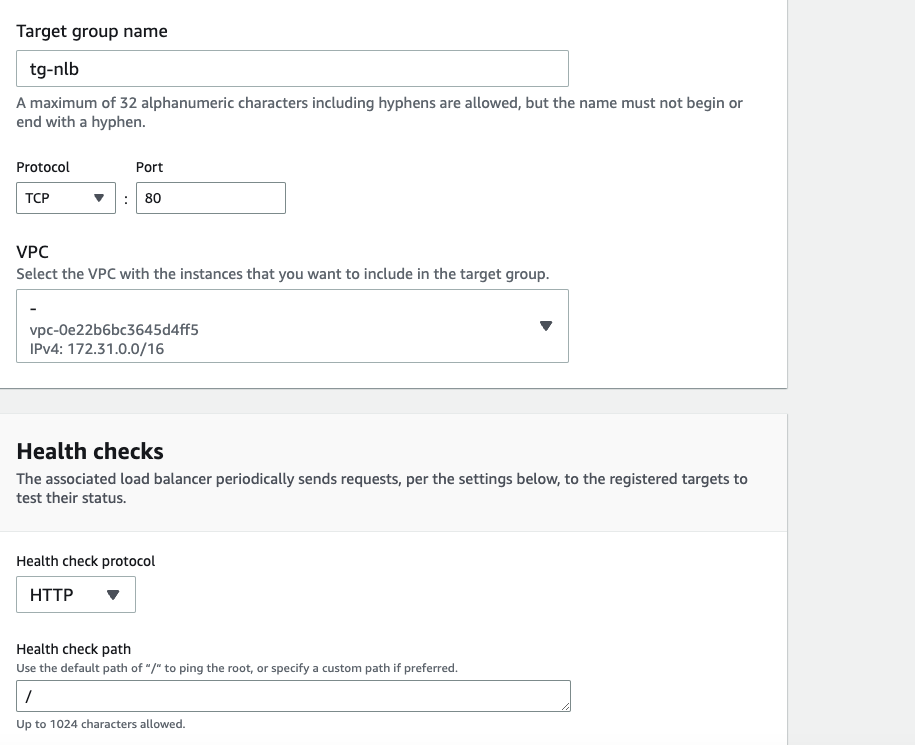
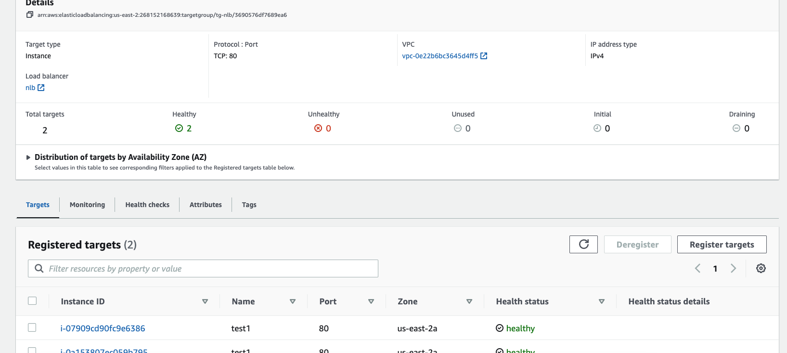
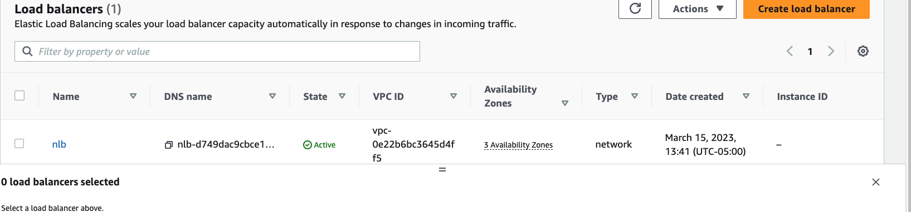

# Project with NLB

For this project I will create the Load Balancer ->
Create -> Network Load balancer -> name it -> Internet-facing of IPv4 -> for network mapping deploy it in 3 different AZs -> here is the IPv4 setting, because NLB has a one-fixed IP address per AZ. It's going to be public, because I choose the th IP, an internet-facing type of network load balancer. i have 3 Azs and fixed 3 IPs. For NLB I have to create target group -> based on instances

Protocol on port 80-> TCP for NLB
HTTP type protocol for health checks -> health threshold is 2 -> timeout is 2 seconds -> interval is 5 -> 2 available instances include them as pending below -> NLB create .

If copy the DNS name to the browser, it seems the network load balancer nicely working -> if refresh the page it can switch between 2 instances.

