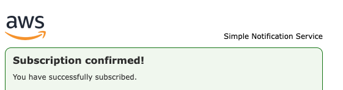
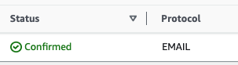

# Sending an Email using Amazon SNS

Navigate to the SNS --> Create topic--> Standard--> give the name Promotopic to the topic--> Create topic

then in the topic--> Create subscription, where yu can choose the endpoint of this--> i choose email--> enter email address--> and you will be able receive the email for confirm subscription--> after confirming you can see this page

Click to the topic--> create publish --> give the name--> Write the notification to consumer --> Create publish
And you can receive the notification to the email

After please delete the created topics and subscriptions

