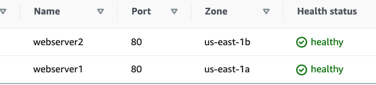

# Create Application Load Balancer

For this project I created two EC2 instances webserver1 and webserver2 in one VPC but with different AZ.

Added inbound rules HTTP for 0.0.0.0/0.

Then created Application Load Balancer, added 2 instances to target groups

Application Load Balancer listener configured as port 80 HTTP. Even if one AZ is down, second one can still working. 