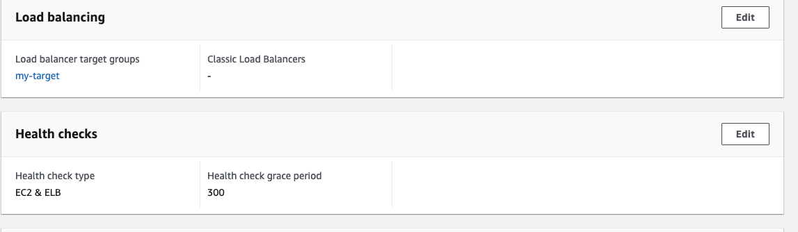

# Practice with creating Auto Scaling Group

Go to EC2 page and under Auto Scaling --> Auto Scaling Groups
Create Auto Scaling Group -> Add group name -> then I need to create Launch Template, it's basically instruction or configuration to use when Auto Scaling Groups go to create instances.
Create launch template --> add name of template--> choose Amazon Linux Machine Image--> have to choose free tier for study purposes--> and in Advanced setting have to add in the User data

```
#!/bin/bash

sudo yum update -y
sudo install httpd -y
sudo systemctl start httpd
sudo systemctl enable httpd 
usermod -aG apache ec2-user
chown -R ec2-user:apache /var/www
chmod 2775 /var/www
echo "Hello world from $(hostname -f)" > /var/www/html/index.html

```
Along with this have to create target group 



