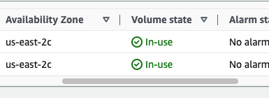

# Creating and attaching EBS volume

So for this reason we have to navigate to EC2 --> launch EC2 instance --> and you can see at the configure storage that has root volume which you can change.

Let's create another volume , go to EC2 page --> Elastic Block store --> Volumes --> Create volume --> General purpose SSD gp2 --> Size 2 Gb--> before creating the volume have to check the AZ for our EC2 instance --> and change AZ for volume --> leave other configurations  and create volume.

For clarifying volumes, i give it the name for root volume and for the second volumes as Media files
After refreshing the page I can see that media files volume is available to use, but it didn't attached yet, but we can attach volume by selecting--> Actions--> Attach volume to the instance. 

Then I can show you how to to do snapshots and restore

Select media file volume --> Actions --> Create snapshot --> Give it the name and create snapshot -->  here and the left hand navigation Snapshots I can see the snapshots which I can select and in Actions window copy the snapshot other AZ, also can create volume from snapshot, typically using the copy of snapshot and create the volume in another AZ

After the shutting down the instance, my root volume could deleted. 