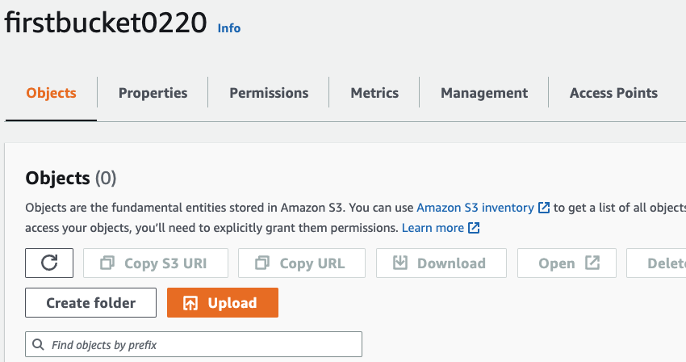
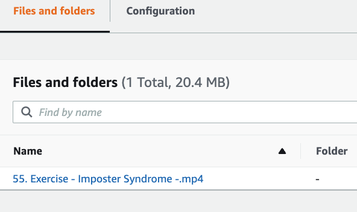
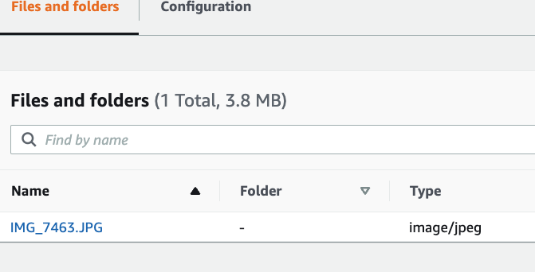
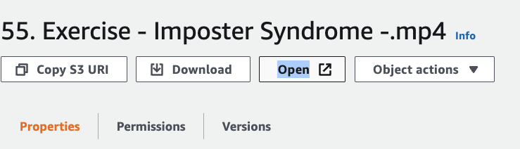
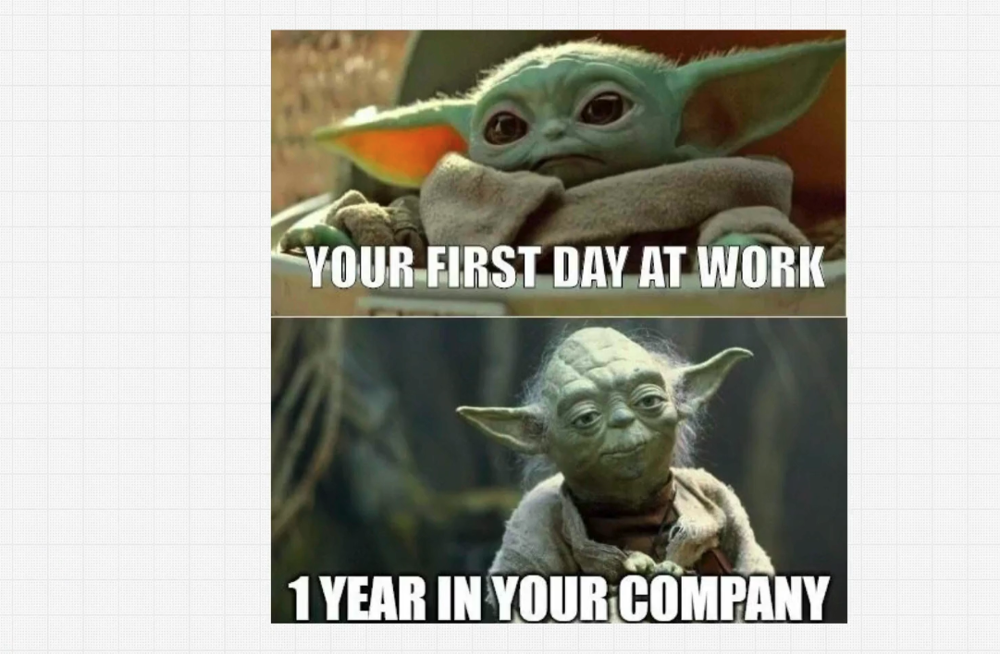

# Creating S3 bucket

Create bucket --> AWS region choose which region is close to you, granting public access is not good idea, AWS makes default to block all public access, bucket versioning, possible recover all versions, all videos, files, by default is turned off, tags can help to easily track costs.
Then server side encryption is disabled by default, advanced setting should be disabled to lock, click create Bucket, and it will show success.

Click to the created bucket and add folder by clicking to the button create folder for the videos and images.

For first folder videos, upload the video:

And upload photo for the folder named Photos

While my bucket is blocked for access, I van open only through the button open this file

And I can open my video and see the content:

You also can download this files from your bucket. For not charging purposes have to delete the bucket, before deleting please empty the bucket by clicking empty and permanent delete.
then delete the bucket
